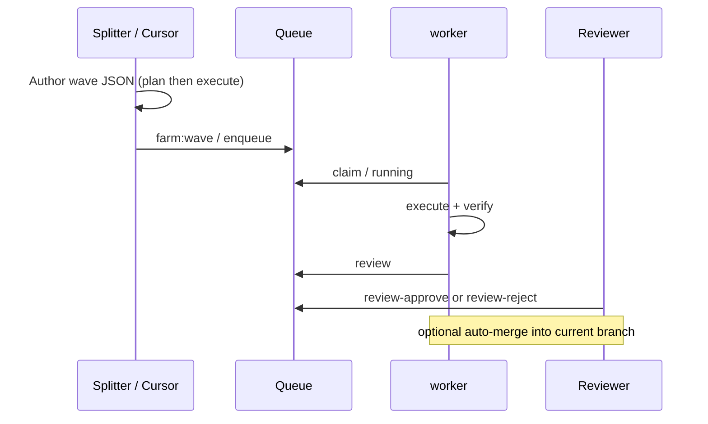

# Async collaboration & wave handoff

This page describes the **minimal team async path**: not a “shared mystery queue”, but a **wave file + dedupe + review + merge** contract you can copy from docs.

## Roles

| Role                            | Typical actions                                                                                                                                                                                  |
| ------------------------------- | ------------------------------------------------------------------------------------------------------------------------------------------------------------------------------------------------ |
| Task splitter (often in Cursor) | Author a JSON array under `.agent-farm/waves/`, or fork **[`examples/waves/team-handoff-min.json`](../../../examples/waves/team-handoff-min.json)** and edit `task_id` / `dedupe_key` / `prompt` |
| Enqueuer                        | `npm run farm:wave -- <wave.json>` or `node scripts/agent-farm-dispatch-batch.mjs <wave.json>` when Bash is unavailable                                                                          |
| Consumer                        | `agent-farm worker` (or workers started by dispatch scripts) **only consumes** the queue and does not enqueue                                                                                    |
| Reviewer                        | `review approve` / `review reject`; if auto-merge is on, follow the merge troubleshooting links below                                                                                            |

## Handoff sequence (two people)

## Review and merge

| Command                                     | Role                                                             |
| ------------------------------------------- | ---------------------------------------------------------------- |
| `agent-farm queue review-approve <task_id>` | Approve review; plan tasks may spawn execute                     |
| `agent-farm queue review-reject <task_id>`  | Reject; often returns to `retry`                                 |
| worker `--auto-merge`                       | After **done**, merge `agent-farm/<task_id>` into current branch |

See **`task_merge_failed`** and **[agent-integration.md](./en/agent-integration.md)** (auto-merge section).

## Contract

1. **dedupe_key**: In most cases **`dedupe_key` equals `task_id`** (see AGENTS.md). Duplicates become `blocked` (`task_deduped_blocked`).
2. **plan before execute**: Use `mode: "plan"` then `mode: "execute"` for the same theme to limit thrash.
3. **Acceptance in `prompt`**: End with an explicit acceptance line, e.g. ``验收：`npm run check && npm test` 必须通过`` or `Acceptance: \`npm run check && npm test\` must pass.`
4. **Do not edit queue SQLite by hand**: Use CLI / domain ports; see **[`docs/agents/queue-database-rules.md`](../../agents/queue-database-rules.md)**.

## Merge & failures

- Auto-merge and `task_merge_failed`: **[`docs/user-guide/en/agent-integration.md`](./en/agent-integration.md)** (Chinese: [**`agent-integration.md`（zh）**](./zh/agent-integration.md)) — section on merging into the current branch, plus repo README notes on `task_merge_failed`.
- Health: `doctor --ci-exit`, local **`npm run ci:health:local`**, and **[`docs/integrations/github-actions-health.md`](../integrations/github-actions-health.md)**.

## BDD regression

Behavior scenarios live under **`test/bdd/`** (scenario first, then implementation). Conventions: **[`test/bdd/README.md`](../../../test/bdd/README.md)**.

→ [User guide index](../README.md)
