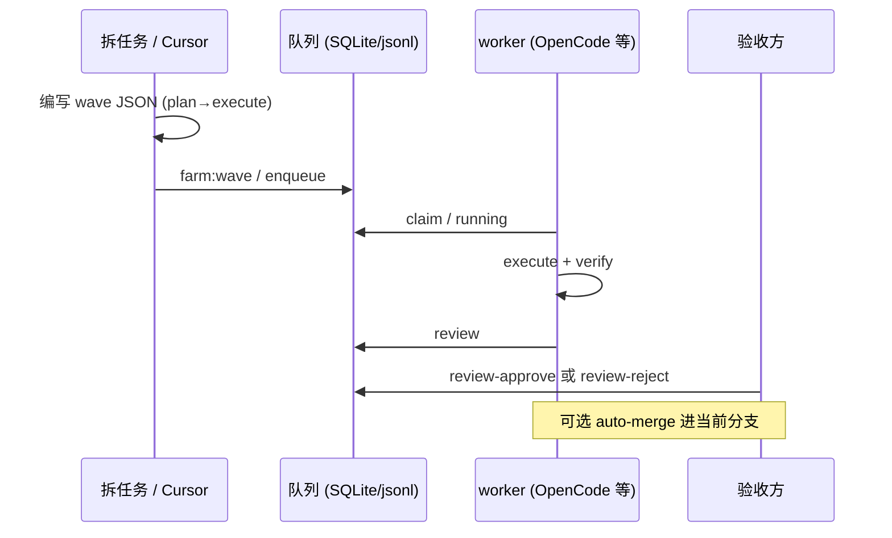

# 异步协作与 wave 交接

本文描述 **团队最小异步路径**：不依赖「共享神秘队列」，而是用 **wave 文件 + dedupe + review + 合并** 形成可复制契约。

## 角色与职责

| 角色 | 典型动作 |
|------|----------|
| 拆任务方（多在 Cursor） | 在 `.agent-farm/waves/` 写 JSON 数组，或维护仓库内示例 **[`examples/waves/team-handoff-min.json`](../../../examples/waves/team-handoff-min.json)** 的副本并改 `task_id` / `dedupe_key` / `prompt` |
| 入队方 | `npm run farm:wave -- <wave.json>` 或 `node scripts/agent-farm-dispatch-batch.mjs <wave.json>`（无 Bash 时） |
| 消费方 | `agent-farm worker`（或 dispatch 脚本附带启动的 worker）只读队列执行，**不再入队** |
| 验收方 | `review approve` / `review reject`；若开启自动合并，见用户指南中 **merge 失败** 排错 |

## 异步交接时序（两人）

## Review 与合并

| 命令 | 作用 |
|------|------|
| `agent-farm queue review-approve <task_id>` | 通过 review；Plan 任务可派生 Execute |
| `agent-farm queue review-reject <task_id>` | 驳回，常回流 `retry` |
| worker `--auto-merge` | 任务 **done** 后把 `agent-farm/<task_id>` 合进当前分支 |

合并失败见 **`task_merge_failed`** 与用户指南 **[agent-integration.md](./agent-integration.md)**「自动合并」小节。

## 契约要点

1. **dedupe_key**：与 AGENTS.md 一致，绝大多数场景下 **`dedupe_key` 等于 `task_id`**，防重复入队；重复时任务会 `blocked`（`task_deduped_blocked`）。
2. **plan 先于 execute**：同一主题先 `mode: "plan"` 再 `mode: "execute"`，减少大范围返工。
3. **prompt 末尾写验收命令**：例如 `验收：\`npm run check && npm test\` 必须通过`，与 worker verify 阶段对齐。
4. **勿直接改队列 SQLite**：一切状态变更经 CLI / `TaskRepository`；见 **[`docs/agents/queue-database-rules.md`](../../agents/queue-database-rules.md)**。

## 合并与失败排错

- 自动合并与 `task_merge_failed`：见 **[`docs/user-guide/zh/agent-integration.md`](./agent-integration.md)**（英文：[**`agent-integration.md`（en）**](./en/agent-integration.md)）中「自动合并进当前分支」与 README 中 `task_merge_failed` 说明。
- 健康巡检：`doctor --ci-exit`、本地等价 **`npm run ci:health:local`**；GitHub Actions 见 **[`docs/integrations/github-actions-health.md`](../integrations/github-actions-health.md)**。

## BDD 回归

本仓库在 **`test/bdd/`** 维护行为场景（先写场景、再实现），约定见 **[`test/bdd/README.md`](../../../test/bdd/README.md)**。

→ [用户指南索引](../README.md)
